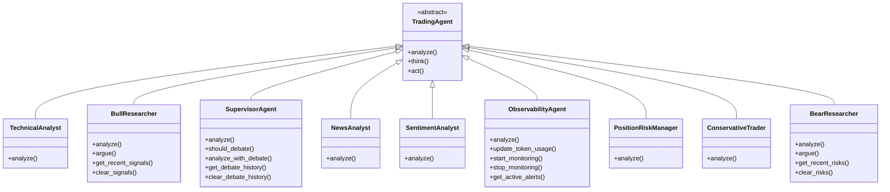

# Agent Hierarchy

*Auto-generated: 2025-12-05 19:44*

This diagram shows the inheritance hierarchy of trading agents.

## Notes

- Agents inherit from base classes in `llm/agents/base.py`
- Each agent specializes in a specific analysis type
- Methods shown are public interface methods
