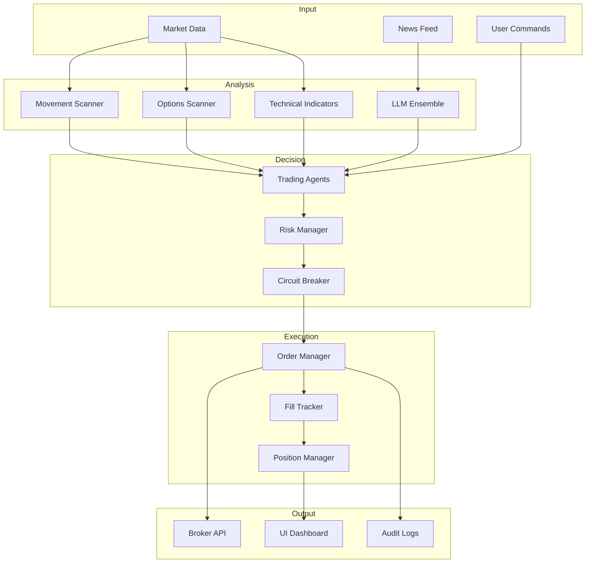

# Trading System Data Flow

*Auto-generated: 2025-12-05 19:44*

This diagram shows how data flows through the trading system.

## Components

### Input Layer
- **Market Data**: Real-time price, volume, options chains
- **News Feed**: Financial news for sentiment analysis
- **User Commands**: Manual trading overrides

### Analysis Layer
- **Scanners**: Detect trading opportunities
- **LLM Ensemble**: Sentiment analysis with multiple models
- **Technical**: RSI, MACD, Bollinger, etc.

### Decision Layer
- **Trading Agents**: Coordinate analysis and generate signals
- **Risk Manager**: Position sizing and exposure limits
- **Circuit Breaker**: Emergency halt on excessive losses

### Execution Layer
- **Order Manager**: Order lifecycle management
- **Fill Tracker**: Execution quality tracking

### Output Layer
- **Broker API**: Charles Schwab integration
- **Dashboard**: Real-time monitoring UI
- **Audit Logs**: Compliance and debugging
