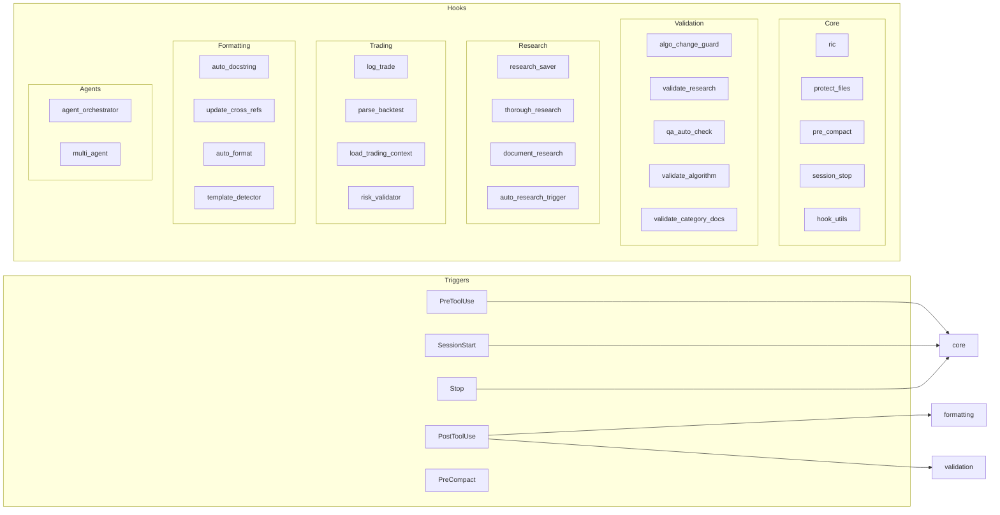

# Claude Code Hook System

*Auto-generated: 2025-12-05 19:44*

This diagram shows the Claude Code hook system architecture.

## Hook Categories

| Category | Purpose |
|----------|---------|
| **core** | RIC Loop, file protection, session management |
| **validation** | Algorithm, research, and QA validation |
| **research** | Research tracking and documentation |
| **trading** | Trading risk and execution hooks |
| **formatting** | Code formatting and cross-references |
| **agents** | Agent orchestration hooks |

Configuration: `.claude/settings.json`
