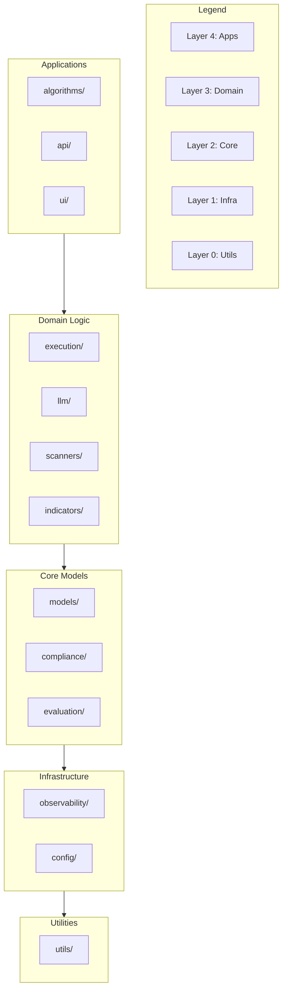

# Module Dependencies

*Auto-generated: 2025-12-05 19:44*

This diagram shows the layer architecture and module dependencies.

## Layer Rules

- **Layer 4 (Applications)**: Can import from all lower layers
- **Layer 3 (Domain Logic)**: Can import from Layer 2, 1, 0
- **Layer 2 (Core Models)**: Can import from Layer 1, 0
- **Layer 1 (Infrastructure)**: Can import from Layer 0 only
- **Layer 0 (Utilities)**: No internal dependencies

Violations are detected by `scripts/check_layer_violations.py`.
