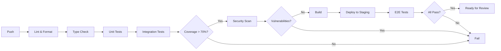

# Instruction Files Upgrade Guide

**Version**: 1.0
**Created**: December 1, 2025
**Based on**: [Workflow Management Research](WORKFLOW_MANAGEMENT_RESEARCH.md)
**Purpose**: Comprehensive guide for upgrading main instruction files to minimize bugs, gaps, and missing processes

---

## Executive Summary

This guide presents **32 actionable upgrades** organized into 8 categories to improve the development workflow, minimize bugs, and eliminate process gaps. Each upgrade includes implementation details, affected files, effort estimates, and expected impact.

**Total Upgrades**: 32
**P0 (Critical)**: 12
**P1 (High)**: 12
**P2 (Medium)**: 8

---

## Upgrade Categories

1. [Quality Gates & Testing](#1-quality-gates--testing) - 6 upgrades
2. [Pre-Commit & Automation](#2-pre-commit--automation) - 4 upgrades
3. [Architectural Decision Records](#3-architectural-decision-records) - 3 upgrades
4. [Root Cause Analysis](#4-root-cause-analysis) - 3 upgrades
5. [AI Agent Patterns](#5-ai-agent-patterns) - 5 upgrades
6. [Trading System Safety](#6-trading-system-safety) - 5 upgrades
7. [Documentation Standards](#7-documentation-standards) - 4 upgrades
8. [CI/CD Pipeline](#8-cicd-pipeline) - 2 upgrades

---

## 1. Quality Gates & Testing

### Upgrade 1.1: Implement Code Coverage Gate

**Priority**: P0 (Critical)
**Effort**: Medium (4-8 hours)
**Impact**: High

**Current State**: 34% coverage with no enforcement
**Target State**: 70% minimum coverage with CI gate

**Implementation**:

1. Add to `.github/workflows/autonomous-testing.yml`:
```yaml
- name: Check coverage
  run: |
    pytest --cov=. --cov-report=xml --cov-fail-under=70
```

2. Add to CLAUDE.md:
```markdown
### Code Coverage Requirements
- Minimum coverage: 70%
- Coverage gate enforced in CI
- New code must include tests
```

**Files to Update**:
- `.github/workflows/autonomous-testing.yml`
- `CLAUDE.md` (Testing Stages section)
- `docs/development/BEST_PRACTICES.md`

---

### Upgrade 1.2: Add Security Scanning Gate

**Priority**: P0 (Critical)
**Effort**: Medium (4-6 hours)
**Impact**: High

**Current State**: No automated security scanning
**Target State**: SAST scanning on every PR

**Implementation**:

1. Add to CI workflow:
```yaml
- name: Security scan
  uses: returntocorp/semgrep-action@v1
  with:
    config: >-
      p/security-audit
      p/secrets
      p/python
```

2. Add to pre-commit:
```yaml
- repo: https://github.com/gitleaks/gitleaks
  rev: v8.18.0
  hooks:
    - id: gitleaks
```

**Files to Update**:
- `.github/workflows/autonomous-testing.yml`
- `.pre-commit-config.yaml`
- `CLAUDE.md` (Security Testing section)

---

### Upgrade 1.3: Implement Test Impact Analysis

**Priority**: P1 (High)
**Effort**: Medium (6-8 hours)
**Impact**: Medium

**Current State**: All tests run on every change
**Target State**: Selective testing based on changed files

**Implementation**:

1. Add test mapping file:
```yaml
# test_mapping.yaml
algorithms/hybrid_options_bot.py:
  - tests/test_hybrid_algorithm.py
  - tests/test_integration.py
execution/smart_execution.py:
  - tests/test_execution.py
```

2. Add selective test script:
```python
# scripts/selective_tests.py
def get_affected_tests(changed_files):
    # Load mapping and return relevant tests
```

**Files to Create**:
- `test_mapping.yaml`
- `scripts/selective_tests.py`

**Files to Update**:
- `.github/workflows/autonomous-testing.yml`
- `CLAUDE.md` (Testing section)

---

### Upgrade 1.4: Add Regression Test Suite

**Priority**: P0 (Critical)
**Effort**: High (12-16 hours)
**Impact**: High

**Current State**: Basic regression tests exist
**Target State**: Comprehensive regression suite with production scenarios

**Implementation**:

1. Create `tests/regression/` directory structure:
```
tests/regression/
├── __init__.py
├── test_historical_bugs.py
├── test_edge_cases.py
├── test_production_scenarios.py
└── fixtures/
    └── historical_data/
```

2. Add to CLAUDE.md:
```markdown
### Regression Testing
- All production bugs must have regression tests
- Run full regression suite before releases
- Historical edge cases documented in tests/regression/
```

**Files to Create**:
- `tests/regression/` directory
- `tests/regression/test_historical_bugs.py`

**Files to Update**:
- `CLAUDE.md`
- `pytest.ini`

---

### Upgrade 1.5: Implement Type Checking Gate

**Priority**: P1 (High)
**Effort**: Low (2-4 hours)
**Impact**: Medium

**Current State**: mypy exists but not enforced
**Target State**: Type checking required to pass in CI

**Implementation**:

1. Update `mypy.ini`:
```ini
[mypy]
python_version = 3.10
warn_return_any = True
warn_unused_ignores = True
disallow_untyped_defs = True
ignore_missing_imports = True
```

2. Add CI step:
```yaml
- name: Type checking
  run: mypy --config-file mypy.ini algorithms/ models/ execution/
```

**Files to Update**:
- `mypy.ini`
- `.github/workflows/autonomous-testing.yml`
- `CLAUDE.md`

---

### Upgrade 1.6: Add Property-Based Testing

**Priority**: P2 (Medium)
**Effort**: Medium (6-8 hours)
**Impact**: Medium

**Current State**: Basic property tests exist
**Target State**: Comprehensive property testing for trading logic

**Implementation**:

1. Expand `tests/test_property_based.py`:
```python
from hypothesis import given, strategies as st

@given(st.floats(min_value=0.01, max_value=1000.0))
def test_position_sizing_always_within_limits(price):
    """Position size must never exceed max allocation"""
    size = calculate_position_size(price, portfolio_value=100000)
    assert 0 <= size <= 0.25 * 100000
```

**Files to Update**:
- `tests/test_property_based.py`
- `CLAUDE.md` (Testing section)

---

## 2. Pre-Commit & Automation

### Upgrade 2.1: Migrate to Ruff

**Priority**: P1 (High)
**Effort**: Low (2-4 hours)
**Impact**: Medium (200x faster linting)

**Current State**: Multiple linters (flake8, black)
**Target State**: Single Ruff configuration

**Implementation**:

1. Update `.pre-commit-config.yaml`:
```yaml
repos:
  - repo: https://github.com/astral-sh/ruff-pre-commit
    rev: v0.7.0
    hooks:
      - id: ruff
        args: [--fix]
      - id: ruff-format
```

2. Create `ruff.toml`:
```toml
[lint]
select = ["E", "F", "I", "N", "W", "UP", "B", "C4", "SIM"]
ignore = ["E501"]

[format]
quote-style = "double"
indent-style = "space"
```

**Files to Create**:
- `ruff.toml`

**Files to Update**:
- `.pre-commit-config.yaml`
- `CLAUDE.md`
- Remove `.flake8` (deprecated)

---

### Upgrade 2.2: Add Commit Message Validation

**Priority**: P2 (Medium)
**Effort**: Low (1-2 hours)
**Impact**: Low

**Current State**: No commit message standards
**Target State**: Conventional commits enforced

**Implementation**:

1. Add to `.pre-commit-config.yaml`:
```yaml
- repo: https://github.com/commitizen-tools/commitizen
  rev: v3.29.0
  hooks:
    - id: commitizen
      stages: [commit-msg]
```

2. Create `.cz.toml`:
```toml
[tool.commitizen]
name = "cz_conventional_commits"
version = "0.1.0"
tag_format = "v$version"
```

**Files to Create**:
- `.cz.toml`

**Files to Update**:
- `.pre-commit-config.yaml`
- `CLAUDE.md` (Commit Guidelines)

---

### Upgrade 2.3: Add Docstring Validation

**Priority**: P2 (Medium)
**Effort**: Low (2-3 hours)
**Impact**: Medium

**Current State**: Docstrings not enforced
**Target State**: Google-style docstrings required

**Implementation**:

1. Add to ruff.toml:
```toml
[lint]
select = ["D"]  # Add pydocstyle

[lint.pydocstyle]
convention = "google"
```

2. Update CLAUDE.md:
```markdown
### Docstring Requirements
- All public functions require docstrings
- Use Google style format
- Include Args, Returns, Raises sections
```

**Files to Update**:
- `ruff.toml`
- `CLAUDE.md`

---

### Upgrade 2.4: Add Import Sorting

**Priority**: P2 (Medium)
**Effort**: Low (1 hour)
**Impact**: Low

**Current State**: Inconsistent import ordering
**Target State**: Automatic import sorting

**Implementation**:

Already included in Ruff with `I` selector. Add to `ruff.toml`:
```toml
[lint.isort]
known-first-party = ["algorithms", "execution", "models", "scanners", "llm", "ui"]
```

**Files to Update**:
- `ruff.toml`

---

## 3. Architectural Decision Records

### Upgrade 3.1: Create ADR Directory Structure

**Priority**: P0 (Critical)
**Effort**: Low (2-3 hours)
**Impact**: High

**Current State**: No formal ADR system
**Target State**: Structured ADR documentation

**Implementation**:

1. Create directory structure:
```
docs/adr/
├── README.md
├── template.md
├── ADR-0001-use-quantconnect-lean.md
├── ADR-0002-charles-schwab-brokerage.md
├── ADR-0003-hybrid-architecture.md
└── ADR-0004-llm-ensemble-approach.md
```

2. Create ADR template:
```markdown
# [ADR-NNNN] [Title]

## Status
[Proposed | Accepted | Deprecated | Superseded by ADR-XXXX]

## Context
[What is the issue motivating this decision?]

## Decision
[What is the change we're proposing?]

## Consequences

### Positive
- [Benefit 1]

### Negative
- [Drawback 1]

### Neutral
- [Effect 1]

## References
- [Link to relevant documentation]
```

**Files to Create**:
- `docs/adr/README.md`
- `docs/adr/template.md`
- Initial ADRs for existing decisions

**Files to Update**:
- `CLAUDE.md` (add ADR requirements)
- `docs/README.md`

---

### Upgrade 3.2: Document Existing Decisions

**Priority**: P1 (High)
**Effort**: Medium (4-6 hours)
**Impact**: High

**Current State**: Decisions scattered in various docs
**Target State**: All major decisions in ADRs

**Decisions to Document**:
1. ADR-0001: Use QuantConnect LEAN Platform
2. ADR-0002: Charles Schwab as Brokerage
3. ADR-0003: Hybrid Architecture (Manual + Autonomous)
4. ADR-0004: LLM Ensemble Approach
5. ADR-0005: Two-Part Spread Strategy
6. ADR-0006: Circuit Breaker Implementation
7. ADR-0007: IV-Based Greeks (No Warmup)

---

### Upgrade 3.3: Add ADR Requirement to Workflow

**Priority**: P1 (High)
**Effort**: Low (1-2 hours)
**Impact**: High

**Implementation**:

Add to CLAUDE.md and UPGRADE_LOOP_WORKFLOW.md:
```markdown
### ADR Requirements

**When ADR Required:**
- New technology adoption
- Architecture pattern changes
- Major library selection
- Breaking changes to APIs
- New integration points

**Process:**
1. Create ADR from template
2. Submit for review (PR)
3. Update status after discussion
4. Link from relevant documentation
```

**Files to Update**:
- `CLAUDE.md`
- `docs/development/UPGRADE_LOOP_WORKFLOW.md`

---

## 4. Root Cause Analysis

### Upgrade 4.1: Create RCA Process

**Priority**: P0 (Critical)
**Effort**: Medium (4-6 hours)
**Impact**: High

**Current State**: No formal RCA process
**Target State**: Structured RCA for all incidents

**Implementation**:

1. Create `docs/processes/ROOT_CAUSE_ANALYSIS.md`:
```markdown
# Root Cause Analysis Process

## When to Perform RCA
- Production incidents
- Critical bugs found in testing
- Performance degradations
- Security vulnerabilities

## 5 Whys Method
1. State the problem
2. Ask "Why?" and answer
3. Repeat 4 more times
4. Identify root cause
5. Define corrective action

## RCA Template
[Include template]

## Post-RCA Actions
1. Create regression test
2. Update documentation
3. Track in metrics
4. Review in retrospective
```

**Files to Create**:
- `docs/processes/ROOT_CAUSE_ANALYSIS.md`
- `docs/processes/rca-template.md`

**Files to Update**:
- `CLAUDE.md`
- `docs/README.md`

---

### Upgrade 4.2: Create Incident Log

**Priority**: P1 (High)
**Effort**: Low (2-3 hours)
**Impact**: Medium

**Implementation**:

1. Create `docs/incidents/README.md`:
```markdown
# Incident Log

| ID | Date | Severity | Summary | RCA Link | Status |
|----|------|----------|---------|----------|--------|
| INC-001 | 2025-12-01 | P1 | [Summary] | [Link] | Resolved |
```

2. Create incident template

**Files to Create**:
- `docs/incidents/README.md`
- `docs/incidents/template.md`

---

### Upgrade 4.3: Add Defect Tracking Metrics

**Priority**: P2 (Medium)
**Effort**: Medium (4-6 hours)
**Impact**: Medium

**Implementation**:

Add to PROJECT_STATUS.md:
```markdown
## Defect Metrics

| Metric | Current | Target | Trend |
|--------|---------|--------|-------|
| Defects Found in Dev | X | >80% | ⬆️ |
| Defects Found in Prod | X | <5% | ⬇️ |
| Mean Time to Fix (P0) | Xh | <4h | ⬇️ |
| Regression Rate | X% | <5% | ⬇️ |
```

**Files to Update**:
- `docs/PROJECT_STATUS.md`

---

## 5. AI Agent Patterns

### Upgrade 5.1: Add Evaluator-Optimizer Loop

**Priority**: P0 (Critical)
**Effort**: High (16-24 hours)
**Impact**: High

**Current State**: Basic evaluation framework
**Target State**: Closed-loop evaluation with automatic improvement

**Implementation**:

This is already partially documented in `docs/research/AUTONOMOUS_AGENT_UPGRADE_GUIDE.md`.

Add to CLAUDE.md:
```markdown
### AI Agent Evaluation Loop

All LLM agents must implement:
1. **Evaluation**: Score outputs against criteria
2. **Feedback**: Identify improvement areas
3. **Refinement**: Update prompts based on feedback
4. **Convergence**: Loop until target score reached

See: [Autonomous Agent Upgrade Guide](docs/research/AUTONOMOUS_AGENT_UPGRADE_GUIDE.md)
```

**Files to Update**:
- `CLAUDE.md`
- `evaluation/feedback_loop.py` (if not exists)

---

### Upgrade 5.2: Add Agent Decision Logging

**Priority**: P0 (Critical)
**Effort**: Medium (6-8 hours)
**Impact**: High

**Current State**: Basic logging
**Target State**: Comprehensive decision audit trail

**Implementation**:

```python
# llm/decision_logger.py
@dataclass
class AgentDecisionLog:
    timestamp: datetime
    agent_name: str
    context: Dict[str, Any]
    reasoning_chain: List[str]
    decision: str
    confidence: float
    alternatives_considered: List[str]
    risk_assessment: str

def log_decision(decision: AgentDecisionLog):
    """Log agent decision for audit and analysis"""
    # Store to Object Store
    # Include in monitoring
    # Enable replay for debugging
```

**Files to Create**:
- `llm/decision_logger.py`

**Files to Update**:
- `CLAUDE.md`
- `llm/agents/base.py`

---

### Upgrade 5.3: Implement Bull/Bear Debate

**Priority**: P1 (High)
**Effort**: High (12-16 hours)
**Impact**: Medium

**Current State**: Single-perspective analysis
**Target State**: Multi-perspective debate for major decisions

**Implementation**:

Already documented in `docs/research/AUTONOMOUS_AGENT_UPGRADE_GUIDE.md` (Section 3.2).

Add trigger criteria to CLAUDE.md:
```markdown
### When to Use Bull/Bear Debate
- Position size > 10% of portfolio
- Confidence < 70%
- Conflicting analyst signals
- High-impact trades
```

---

### Upgrade 5.4: Add Agent Performance Dashboard

**Priority**: P2 (Medium)
**Effort**: Medium (8-12 hours)
**Impact**: Medium

**Implementation**:

Add metrics tracking:
```python
# evaluation/agent_metrics.py
class AgentMetrics:
    task_completion_rate: float
    decision_accuracy: float
    average_confidence: float
    reasoning_quality_score: float
    hallucination_rate: float
```

---

### Upgrade 5.5: Implement Self-Evolving Prompts

**Priority**: P2 (Medium)
**Effort**: High (16-20 hours)
**Impact**: High

**Implementation**:

Already documented in `docs/research/AUTONOMOUS_AGENT_UPGRADE_GUIDE.md` (Section 3.1).

Key integration point for CLAUDE.md:
```markdown
### Self-Evolving Agent System
Agents automatically improve through:
1. Collect feedback from evaluations
2. Identify weak areas
3. Generate prompt refinements
4. Test improvements
5. Deploy if score improves
```

---

## 6. Trading System Safety

### Upgrade 6.1: Add Monte Carlo Stress Testing

**Priority**: P0 (Critical)
**Effort**: High (12-16 hours)
**Impact**: High

**Current State**: Basic backtesting
**Target State**: Monte Carlo simulation for risk analysis

**Implementation**:

```python
# tests/test_monte_carlo.py (enhance existing)
def test_strategy_under_volatility_regimes():
    """Test strategy across 1000 simulated market scenarios"""
    scenarios = generate_monte_carlo_scenarios(
        n_simulations=1000,
        volatility_range=(0.1, 0.5),
        trend_range=(-0.3, 0.3)
    )

    results = []
    for scenario in scenarios:
        result = run_backtest(strategy, scenario)
        results.append(result)

    assert np.percentile([r.max_drawdown for r in results], 95) < 0.25
    assert np.percentile([r.sharpe_ratio for r in results], 5) > 0.5
```

**Files to Update**:
- `tests/test_monte_carlo.py`
- `CLAUDE.md`

---

### Upgrade 6.2: Add Kill Switch Testing

**Priority**: P0 (Critical)
**Effort**: Medium (4-6 hours)
**Impact**: High

**Current State**: Circuit breaker exists but limited testing
**Target State**: Comprehensive kill switch scenarios tested

**Implementation**:

Add to `tests/test_circuit_breaker.py`:
```python
class TestKillSwitchScenarios:
    def test_rapid_loss_triggers_halt(self):
        """3% loss in 1 minute triggers immediate halt"""

    def test_flash_crash_protection(self):
        """10% market drop triggers defensive mode"""

    def test_api_failure_graceful_shutdown(self):
        """Broker API failure closes positions safely"""

    def test_manual_override_works(self):
        """Human can halt trading at any time"""
```

**Files to Update**:
- `tests/test_circuit_breaker.py`
- `CLAUDE.md`

---

### Upgrade 6.3: Add Position Limit Enforcement

**Priority**: P0 (Critical)
**Effort**: Medium (4-6 hours)
**Impact**: High

**Current State**: Limits in config but not all paths enforce
**Target State**: All trading paths enforce position limits

**Implementation**:

Add pre-trade validation:
```python
# execution/pre_trade_validator.py
class PreTradeValidator:
    def validate(self, order: Order) -> ValidationResult:
        checks = [
            self._check_position_limit(order),
            self._check_daily_loss_limit(order),
            self._check_concentration_limit(order),
            self._check_circuit_breaker(order),
        ]
        return ValidationResult(
            approved=all(c.passed for c in checks),
            failed_checks=[c for c in checks if not c.passed]
        )
```

**Files to Create**:
- `execution/pre_trade_validator.py`

**Files to Update**:
- `CLAUDE.md`
- All execution modules

---

### Upgrade 6.4: Add Slippage Monitoring

**Priority**: P1 (High)
**Effort**: Medium (6-8 hours)
**Impact**: Medium

**Implementation**:

```python
# execution/slippage_monitor.py
class SlippageMonitor:
    def record_fill(self, expected_price: float, actual_price: float):
        slippage = (actual_price - expected_price) / expected_price
        self.slippage_history.append(slippage)

        if abs(slippage) > self.alert_threshold:
            self.alert(f"High slippage: {slippage:.2%}")
```

---

### Upgrade 6.5: Add Execution Quality Metrics

**Priority**: P1 (High)
**Effort**: Medium (4-6 hours)
**Impact**: Medium

**Implementation**:

Add to PROJECT_STATUS.md:
```markdown
## Execution Quality Metrics

| Metric | Current | Target |
|--------|---------|--------|
| Fill Rate | X% | >25% |
| Average Slippage | X bps | <10 bps |
| Order Latency | Xms | <100ms |
| Cancel Rate | X% | <20% |
```

---

## 7. Documentation Standards

### Upgrade 7.1: Create Internal Knowledge Base

**Priority**: P1 (High)
**Effort**: Medium (6-8 hours)
**Impact**: High

**Implementation**:

Create `docs/knowledge-base/`:
```
docs/knowledge-base/
├── README.md
├── troubleshooting/
│   ├── common-errors.md
│   ├── performance-issues.md
│   └── integration-problems.md
├── how-to/
│   ├── add-new-strategy.md
│   ├── configure-risk-limits.md
│   └── run-backtests.md
└── reference/
    ├── glossary.md
    └── error-codes.md
```

**Files to Create**:
- `docs/knowledge-base/` directory structure
- Initial articles

**Files to Update**:
- `docs/README.md`
- `CLAUDE.md`

---

### Upgrade 7.2: Add Error Code System

**Priority**: P2 (Medium)
**Effort**: Medium (4-6 hours)
**Impact**: Medium

**Implementation**:

```python
# models/exceptions.py (enhance)
class TradingError(Exception):
    """Base trading error with code"""
    code: str
    message: str
    recovery_hint: str
    documentation_url: str

class E001_InsufficientBalance(TradingError):
    code = "E001"
    message = "Insufficient balance for trade"
    recovery_hint = "Reduce position size or add funds"
    documentation_url = "docs/knowledge-base/troubleshooting/common-errors.md#e001"
```

---

### Upgrade 7.3: Add API Documentation

**Priority**: P1 (High)
**Effort**: Medium (6-8 hours)
**Impact**: Medium

**Implementation**:

Add API docs for all public modules using Google-style docstrings and generate with pdoc or mkdocs.

Create `docs/api/`:
```
docs/api/
├── README.md
├── algorithms.md
├── execution.md
├── models.md
└── llm.md
```

---

### Upgrade 7.4: Implement Docs-as-Code

**Priority**: P2 (Medium)
**Effort**: Low (2-4 hours)
**Impact**: Medium

**Implementation**:

Add documentation linting to CI:
```yaml
- name: Lint documentation
  run: |
    pip install doc8
    doc8 docs/ --max-line-length 100
```

Add to pre-commit:
```yaml
- repo: https://github.com/PyCQA/doc8
  rev: v1.1.1
  hooks:
    - id: doc8
```

---

## 8. CI/CD Pipeline

### Upgrade 8.1: Add Pipeline Visualization

**Priority**: P2 (Medium)
**Effort**: Low (2-3 hours)
**Impact**: Low

**Implementation**:

Add Mermaid diagram to CLAUDE.md:
```markdown
### CI/CD Pipeline Flow


```

---

### Upgrade 8.2: Add Deployment Checklist

**Priority**: P1 (High)
**Effort**: Low (2-3 hours)
**Impact**: High

**Implementation**:

Add to CLAUDE.md:
```markdown
### Pre-Deployment Checklist

Before deploying to paper/live trading:

- [ ] All tests pass (>70% coverage)
- [ ] No critical security vulnerabilities
- [ ] Type checking clean
- [ ] Documentation updated
- [ ] ADR created (if architecture change)
- [ ] RCA complete (if bug fix)
- [ ] Backtest metrics meet targets
- [ ] Circuit breaker tested
- [ ] Kill switch verified
- [ ] Human approval obtained
```

---

## Implementation Priority Matrix

### P0 - Critical (Implement First)

| # | Upgrade | Effort | Files |
|---|---------|--------|-------|
| 1.1 | Code Coverage Gate | Medium | 3 |
| 1.2 | Security Scanning | Medium | 3 |
| 1.4 | Regression Suite | High | 4 |
| 3.1 | ADR Directory | Low | 4+ |
| 4.1 | RCA Process | Medium | 4 |
| 5.1 | Evaluator-Optimizer | High | 3 |
| 5.2 | Decision Logging | Medium | 3 |
| 6.1 | Monte Carlo Testing | High | 2 |
| 6.2 | Kill Switch Testing | Medium | 2 |
| 6.3 | Position Enforcement | Medium | 3 |

### P1 - High (Implement Second)

| # | Upgrade | Effort | Files |
|---|---------|--------|-------|
| 1.3 | Test Impact Analysis | Medium | 3 |
| 1.5 | Type Checking Gate | Low | 3 |
| 2.1 | Migrate to Ruff | Low | 3 |
| 3.2 | Document Decisions | Medium | 7+ |
| 3.3 | ADR Requirement | Low | 2 |
| 4.2 | Incident Log | Low | 2 |
| 5.3 | Bull/Bear Debate | High | 2 |
| 6.4 | Slippage Monitoring | Medium | 2 |
| 6.5 | Execution Metrics | Medium | 2 |
| 7.1 | Knowledge Base | Medium | 6+ |
| 7.3 | API Documentation | Medium | 5 |
| 8.2 | Deployment Checklist | Low | 1 |

### P2 - Medium (Implement Third)

| # | Upgrade | Effort | Files |
|---|---------|--------|-------|
| 1.6 | Property Testing | Medium | 2 |
| 2.2 | Commit Messages | Low | 2 |
| 2.3 | Docstring Validation | Low | 2 |
| 2.4 | Import Sorting | Low | 1 |
| 4.3 | Defect Metrics | Medium | 1 |
| 5.4 | Agent Dashboard | Medium | 2 |
| 5.5 | Self-Evolving Prompts | High | 2 |
| 7.2 | Error Code System | Medium | 2 |
| 7.4 | Docs-as-Code | Low | 2 |
| 8.1 | Pipeline Visualization | Low | 1 |

---

## Full Implementation Checklist

### Phase 1: Foundation (Week 1-2)

- [ ] 1.1 Code Coverage Gate
- [ ] 1.2 Security Scanning Gate
- [ ] 1.5 Type Checking Gate
- [ ] 2.1 Migrate to Ruff
- [ ] 3.1 Create ADR Directory
- [ ] 4.1 Create RCA Process
- [ ] 8.2 Deployment Checklist

### Phase 2: Testing (Week 3-4)

- [ ] 1.3 Test Impact Analysis
- [ ] 1.4 Regression Test Suite
- [ ] 6.1 Monte Carlo Testing
- [ ] 6.2 Kill Switch Testing
- [ ] 6.3 Position Enforcement

### Phase 3: AI & Trading (Week 5-6)

- [ ] 5.1 Evaluator-Optimizer Loop
- [ ] 5.2 Decision Logging
- [ ] 5.3 Bull/Bear Debate
- [ ] 6.4 Slippage Monitoring
- [ ] 6.5 Execution Metrics

### Phase 4: Documentation (Week 7-8)

- [ ] 3.2 Document Existing Decisions
- [ ] 3.3 ADR Requirement
- [ ] 4.2 Incident Log
- [ ] 7.1 Knowledge Base
- [ ] 7.3 API Documentation

### Phase 5: Polish (Week 9-10)

- [ ] 1.6 Property Testing
- [ ] 2.2 Commit Messages
- [ ] 2.3 Docstring Validation
- [ ] 4.3 Defect Metrics
- [ ] 5.4 Agent Dashboard
- [ ] 7.2 Error Code System
- [ ] 7.4 Docs-as-Code
- [ ] 8.1 Pipeline Visualization

---

## Change Log

| Date | Version | Change |
|------|---------|--------|
| 2025-12-01 | 1.0 | Initial upgrade guide created |

---

**Based On**: [Workflow Management Research](WORKFLOW_MANAGEMENT_RESEARCH.md)
**Maintained By**: Claude Code Agent
**Review Schedule**: Monthly
